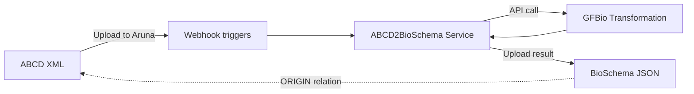
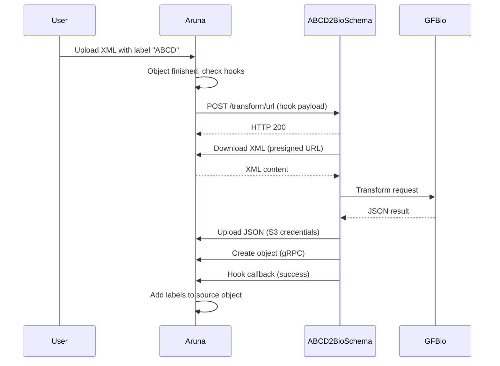

# ABCD2BioSchema Transformation Service

The ABCD2BioSchema service automatically converts biological collection metadata from the [ABCD](https://abcd.tdwg.org/) 
XML format to [BioSchema](https://bioschemas.org/)-compliant JSON. It integrates with Aruna via webhooks and uses 
the [GFBio Transformation API](https://transformation.gfbio.org) for the conversion process.

---

## Purpose of this Service

Researchers working with biological collection data often need to publish metadata in standardized formats.
The ABCD (Access to Biological Collection Data) standard is widely used for specimen data, while BioSchema 
provides semantic markup to improve discoverability on the web.

This service combines the two: upload your ABCD XML to Aruna, add the 'ABCD' label, and the transformation happens 
automatically. The resulting BioSchema JSON is stored alongside the original and is linked via provenance relationships.



---

## Quick Start

### Prerequisites

- Running [Aruna instance](https://docs.aruna-engine.org/latest/get_started/basic_usage/01_Get-Access/)
- Valid Aruna API token with hook permissions
- Docker and Docker Compose

### Deploy the Service

1. **Clone the repository:**
    ```bash
    git clone https://github.com/arunaengine/ABCD2BioSchema.git
    cd ABCD2BioSchema
    ```

2. **Configure environment:**
    ```bash
    cp .env.example .env
    # Edit .env with your settings
    ```

3. **Start the service:**
    ```bash
    ./build-and-run.sh deploy
    ```

4. **Verify it's running:**
    ```bash
    curl http://localhost:5000/health
    # {"status":"ok","message":"ABCD2BioSchema Service is running"}
    ```

### Register the Webhook

Register the service with your Aruna instance to receive transformation triggers. See the 
[Hooks documentation](https://docs.aruna-engine.org/latest/get_started/basic_usage/13_How-To-Hooks/) for details.

```bash
curl -X POST 'https://your-aruna-instance.com/v2/hooks' \
  -H "Authorization: Bearer ${TOKEN}" \
  -H 'Content-Type: application/json' \
  -d '{
    "name": "ABCD2BioSchema",
    "trigger": {
      "triggerType": "TRIGGER_TYPE_OBJECT_FINISHED",
      "filters": [{
        "keyValue": {
          "key": "^ABCD$",
          "value": ".*",
          "variant": "KEY_VALUE_VARIANT_LABEL"
        }
      }]
    },
    "hook": {
      "externalHook": {
        "url": "http://your-service-host:5000/transform/url",
        "method": "METHOD_POST"
      }
    },
    "projectIds": ["your-project-id"],
    "timeout": "1735689600000"
  }'
```

### Trigger a Transformation

Upload any ABCD XML file to Aruna and add the label `ABCD`. The service will then automatically:

1. Download the XML via the presigned URL
2. Send it to the GFBio API for transformation
3. Upload the resulting JSON back to Aruna
4. Create an `ORIGIN` relationship to link the result back to the source ABCD file
5. Add the labels `BioSchema: true` and `TRANSFORMED_BY_GFBIO: success`

---

## Configuration

### Environment Variables

| Variable               | Required  | Default   | Description                                                        |
|------------------------|-----------|-----------|--------------------------------------------------------------------|
| `ARUNA_SERVER_ADDRESS` | Yes       | —         | Aruna gRPC endpoint (e.g., `https://api.aruna.example.com`)        |
| `GFBIO_BASE_URL`       | Yes       | —         | GFBio API base URL                                                 |
| `TEMP_DIR`             | Yes       | —         | Directory for temporary files                                      |
| `SERVER_HOST`          | No        | `0.0.0.0` | Bind address                                                       |
| `SERVICE_PORT`         | No        | `3000`    | HTTP port                                                          |
| `TRANSFORMATION_ID`    | No        | `5`       | GFBio transformation type (5 for ABCD to BioSchema transformation) |

!!! example "Example .env"
    ```bash
    ARUNA_SERVER_ADDRESS=http://server:50051
    GFBIO_BASE_URL=https://transformation.gfbio.org/api
    TEMP_DIR=/app/temp
    SERVICE_PORT=5000
    TRANSFORMATION_ID=5
    ```

### Docker Compose Integration

The service integrates into an existing Aruna docker-compose setup. Add this to your `docker-compose.yml`:

```yaml
services:
  abcd2bioschema:
    build:
      context: ./ABCD2BioSchema
      dockerfile: Dockerfile
    container_name: abcd2bioschema
    ports:
      - "5000:5000"
    environment:
      - RUST_LOG=info
      - GFBIO_BASE_URL=https://transformation.gfbio.org/api
      - TEMP_DIR=/app/temp
    volumes:
      - abcd_temp:/app/temp
    depends_on:
      server:
        condition: service_started
    healthcheck:
      test: ["CMD", "curl", "-f", "http://localhost:5000/health"]
      interval: 30s
      timeout: 10s
      retries: 3
    env_file:
      - .env

volumes:
  abcd_temp:
    driver: local
```

---

## API Endpoints

### Health Check

```
GET /health
```

Returns service status. Use this for monitoring and load balancer health checks.

??? example "Response"
    ```json
    {
      "status": "ok",
      "message": "ABCD2BioSchema Service is running"
    }
    ```

### Transform via Webhook

```
POST /transform/url
```

Primary endpoint called by Aruna webhooks. Receives the hook payload and processes the transformation asynchronously.

??? example "Request Payload (sent by Aruna)"
    ```json
    {
      "hook_id": "hook-abc-123",
      "secret": "webhook-secret",
      "object": {
        "object": {
          "id": "obj-xyz-789",
          "name": "specimen_data.xml",
          "content_len": 2048576,
          "key_values": [
            {"key": "ABCD", "value": "true", "variant": 1}
          ]
        }
      },
      "download": "https://s3.aruna.example.com/bucket/obj-xyz-789?...",
      "token": "temporary-api-token",
      "access_key": "temp-access-key",
      "secret_key": "temp-secret-key",
      "pubkey_serial": 1
    }
    ```

### Transform via Upload

```
POST /transform
```

Alternative endpoint for direct file uploads (without Aruna webhook). Useful for testing.

**Query Parameters:**

- `transformation_id` (optional): GFBio transformation type
- `version_id` (optional): Transformation version

**Body:** Multipart form with field `xml_file`

??? example "curl Example"
    ```bash
    curl -X POST "http://localhost:5000/transform?transformation_id=5" \
      -F "xml_file=@specimen.xml"
    ```

### Job Status

```
GET /job/{job_id}
```

Query the status of a transformation job.

---

## Transformation Output

When the service processes an ABCD file, it creates a new object in Aruna with these properties:

| Property        | Value                                                                                     |
|-----------------|-------------------------------------------------------------------------------------------|
| **Name**        | Original filename with `.json` extension                                                  |
| **Title**       | `{Original Title} BioSchema`                                                              |
| **Description** | Explains the transformation + original description                                        |
| **Labels**      | `BioSchema: true`, `TRANSFORMED_BY_GFBIO: success`, plus inherited labels (except `ABCD`) |
| **Relations**   | `ORIGIN` → source ABCD file                                                               |
| **Licenses**    | Inherited from source                                                                     |
| **Authors**     | Inherited from source                                                                     |
| **Parent**      | Same project/collection/dataset as source                                                 |

!!! info "Provenance"
    The `ORIGIN` relationship ensures full traceability. You can always navigate from the BioSchema JSON back to its ABCD XML source.

---

## How Webhooks Work

The service receives events from Aruna via webhooks. Here's the communication flow:



### The Hook Payload

Aruna sends everything the service needs in a single request:

```rust
pub struct Hook {
    pub hook_id: String,           // Unique invocation ID
    pub secret: String,            // Verification token
    pub object: Resource,          // Full object metadata
    pub download: Option<String>,  // Presigned download URL
    pub access_key: Option<String>,// Temporary S3 credentials
    pub secret_key: Option<String>,
    pub token: String,             // API token for callbacks
    pub pubkey_serial: i32,
}
```

### Callbacks

After processing, the service notifies Aruna of the result via gRPC callback. This updates the source object's labels:

**On success:**
```
Label: TRANSFORMED_BY_GFBIO = success
```

**On failure:**
```
Label: Error = {error message}
```

!!! warning "Callbacks Are Required"
    Always send a callback, even in the event of a failure. Without this, Aruna will be unable to update the object status, 
    meaning users won't know what happened.

---

## Error Handling

The service handles errors at each stage and reports them back to Aruna.

| Error Type           | Handling                                |
|----------------------|-----------------------------------------|
| Missing download URL | Immediate error callback, return 400    |
| Download failure     | Error callback with details, return 502 |
| GFBio API failure    | Error callback, return 502              |
| Upload failure       | Error callback, return 500              |
| Callback failure     | Log error, return 500 (work was done)   |

Errors appear as labels on the source object, making them visible to users in the Aruna UI.

---

## Development

### Project Structure

```
ABCD2BioSchema/
├── src/
│   ├── main.rs        # Server setup, routing
│   ├── service.rs     # HTTP endpoint handlers
│   ├── webhook.rs     # Core transformation logic
│   ├── models.rs      # Data structures
│   └── job.rs         # Job tracking
├── Dockerfile
├── docker-compose.yml
├── build-and-run.sh
└── .env.example
```

### Build Commands

The `build-and-run.sh` script provides convenient commands:

```bash
./build-and-run.sh build    # Build Docker image
./build-and-run.sh test     # Build and run tests
./build-and-run.sh deploy   # Build, deploy, health check
./build-and-run.sh logs     # Show service logs
./build-and-run.sh stop     # Stop all services
./build-and-run.sh restart  # Full restart
```

### Local Development

For development without Docker:

```bash
# Install dependencies
cargo build

# Set environment
export ARUNA_SERVER_ADDRESS=http://localhost:50051
export GFBIO_BASE_URL=https://transformation.gfbio.org/api
export TEMP_DIR=./temp
export SERVICE_PORT=5000

# Run
cargo run
```

### Testing

**Manual webhook test:**

```bash
curl -X POST http://localhost:5000/transform/url \
  -H "Content-Type: application/json" \
  -d '{
    "hook_id": "test-123",
    "secret": "test-secret",
    "object": {
      "object": {
        "id": "obj-456",
        "name": "test.xml",
        "content_len": 1024,
        "key_values": [{"key": "ABCD", "value": "true", "variant": 1}]
      }
    },
    "download": "https://example.com/test.xml",
    "token": "test-token",
    "pubkey_serial": 1
  }'
```

**Direct file upload test:**

```bash
curl -X POST "http://localhost:5000/transform" \
  -F "xml_file=@test_specimen.xml"
```

---

## Troubleshooting

??? question "Webhook doesn't trigger"
    - Verify the hook is registered: `GET /v2/hooks/owner/{userId}`
    - Check that the object has the `ABCD` label
    - Ensure the service URL is reachable from Aruna's network
    - Check service logs: `docker compose logs abcd2bioschema`

??? question "Transformation fails"
    - Verify GFBio API is accessible: `curl https://transformation.gfbio.org/api`
    - Check if the XML is valid ABCD format
    - Look for detailed errors in service logs

??? question "Upload fails"
    - S3 credentials from payload may have expired (rare)
    - Check network connectivity between service and Aruna S3
    - Verify the service has the `access_key` and `secret_key` in the payload

??? question "Callback fails"
    - Ensure the `token` in the payload has hook callback permissions
    - Verify gRPC connectivity to `ARUNA_SERVER_ADDRESS`
    - Check that TLS is configured correctly for HTTPS endpoints
